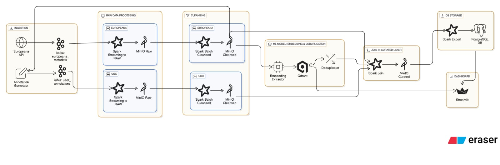

# 📚 Cultural Heritage Big Data Pipeline

## 1. Overview
> Breve introduzione al progetto: obiettivo, ambito applicativo, tecnologie principali.

This project aims to design and prototype a big data system that supports the digitization, analysis, and exploration of large-scale cultural heritage collections. These include artifacts, manuscripts, images, and user-contributed metadata from museums, libraries, and historical archives.

This project implements a full data pipeline for collecting, ingesting, processing, and serving cultural heritage data. It includes simulated user interactions and metadata ingestion into Kafka, followed by structured processing with Apache Spark and storage in MinIO using a Delta Lake architecture.
The pipeline supports semantic deduplication, metadata enrichment, and content-based recommendations. Deduplicated and enriched data is then exported from MinIO to PostgreSQL, which integrates with the serving layer to power structured queries and dashboard visualizations.

The Streamlit dashboard lets users explore cultural content through search, filtering, and similarity-based navigation.

---

## 2. System architecture

### 2.1 Architecture overview

### 2.2 Data flow diagram

### 2.3 File structure

---

## 3. Data Sources

### 3.1 Europeana Metadata
> Descrizione delle query, campi chiave, struttura JSON.

### 3.2 User Annotations (Synthetic)
> Come vengono generate, struttura dei messaggi, scopo.

---

## 4. Technologies Used
> Tabella o elenco con: tecnologia – ruolo – motivazione.

---

## 5. Pipeline Stages

### 5.1 Ingestion Layer
- Kafka producers
- Europeana API fetch
- Annotation generator

### 5.2 Raw Storage
- Salvataggio JSON su MinIO
- Strategie di partizionamento e batching

### 5.3 Cleansing Layer
- Validazione
- Normalizzazione
- Output in Delta Lake

### 5.4 Machine Learning Model
- CLIP embedding (image + text)
- Salvataggio su Qdrant
- Deduplicazione semantica

### 5.5 Join to Curated Layer
- Join tra oggetti Europeana e annotazioni
- Uso di canonical_id
- Output finale (Delta + PostgreSQL)

### 5.6 Serving Layer
- PostgreSQL per dashboard e query
- Qdrant per recommendation
- Streamlit UI

---

## 6. How to Run
PREREQUISITI RAM CPU
### 6.1 Docker Compose Setup
> Spiegazione dei servizi, volumi, reti.

### 6.2 Environment Variables
> API keys, endpoint, accesso a MinIO/Postgres/Qdrant.

### 6.3 Build & Run Commands
> Comandi principali per avviare il sistema.

---

## 7. Example Usage

### 7.1 Dashboard Features
> Esplorazione, filtri, similar images, dettagli.

### 7.2 Query Examples
> Query su PostgreSQL (es. filtra per autore)  
> Query su Qdrant (es. simili per embedding)

---

## 8. Results & Evaluation
> Dati sulla deduplicazione, numero oggetti ingestiti, performance.

---
## 9. Lessons Learned
> Cosa ha funzionato, cosa no, insight tecnici.

---
## 10. Limitations & Future Work
> Cosa manca, cosa può essere migliorato, estensioni possibili.

---
## 11. References & Acknowledgments

- [PostgreSQL vs Redis](https://risingwave.com/blog/postgresql-vs-redis-performance-and-use-case-comparison/)

- [Spark vs Flink](https://www.datacamp.com/blog/flink-vs-spark)

- [Delta Lake documentation](https://delta.io/)

- [Delta Lake Architecture explenation](https://medium.com/codex/delta-lake-architecture-simplifying-data-engineering-analytics-needs-8d8be8459678)

- [Europeana API Key](https://pro.europeana.eu/page/get-api)

## 12. Authors & Contact
This project was developed by Group number 8 represented by:

1. Silvia Bortoluzzi - [@silviabortoluzzi](https://github.com/silviabortoluzzi)
2. Diego Conti - [@diecccoo](https://github.com/diecccoo)
3. Sara Lammouchi - [@saralammouchi](https://github.com/saralammouchi)

---
