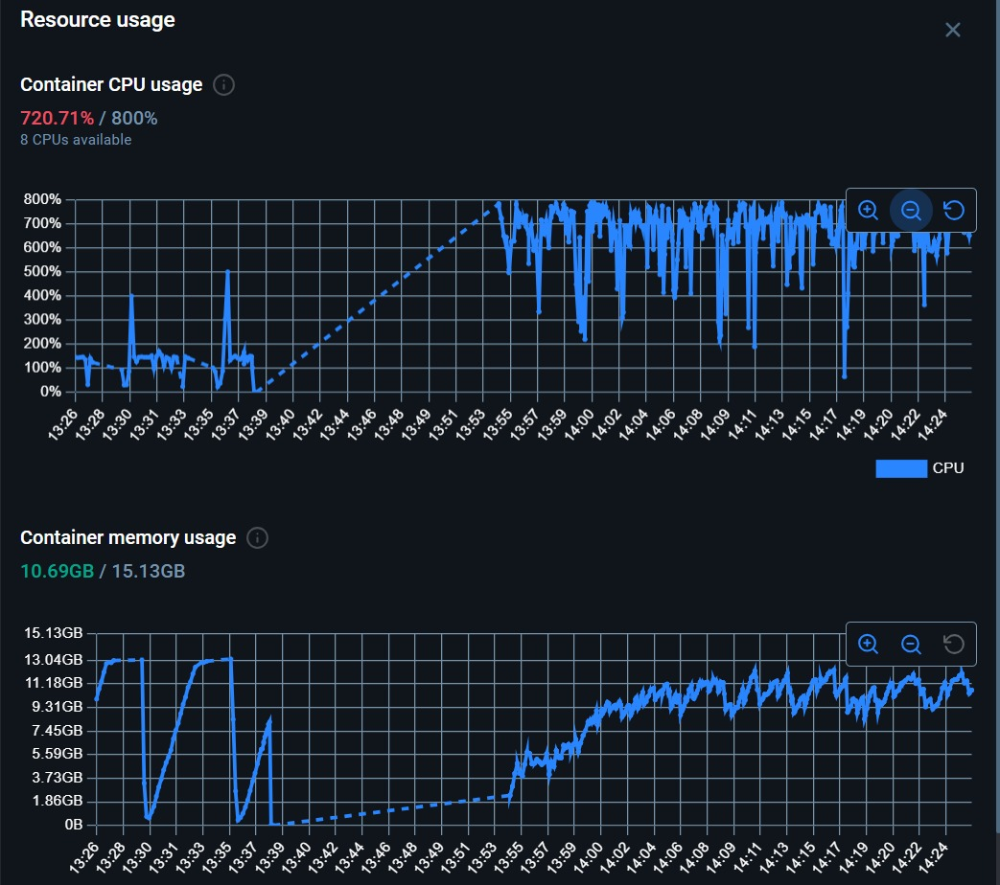
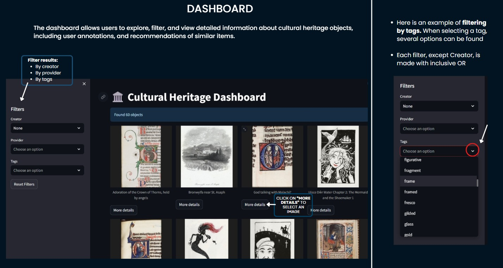
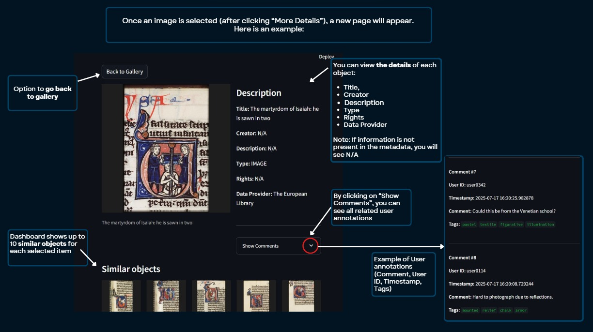
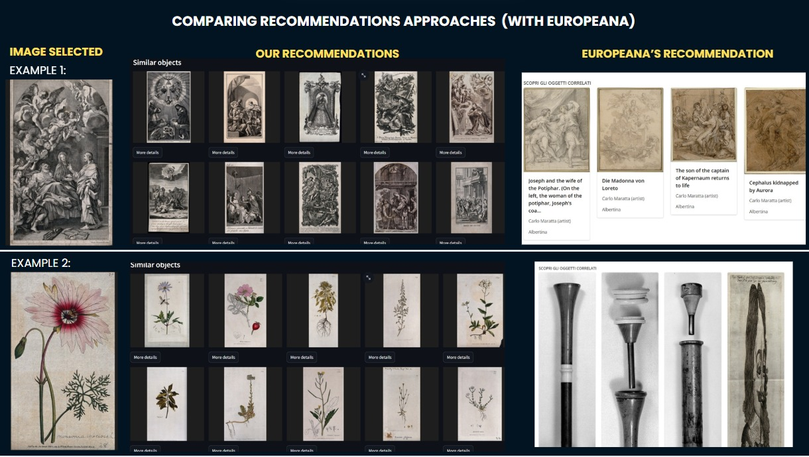

# Cultural Heritage Project

Welcome to our Cultural Heritage Big Data Project.  
This document provides a comprehensive overview of the system architecture, technologies used, and implementation details of our pipeline for processing and exploring cultural heritage data.

## Table of Contents

- [1. Overview](#1-overview)
- [2. System Architecture](#2-system-architecture)
  - [2.1 Architecture Overview](#21-architecture-overview)
  - [2.2 Data Flow Diagram](#22-data-flow-diagram)
  - [2.3 Repository Structure](#23-repository-structure)
- [3. Data Sources](#3-data-sources)
  - [3.1 Europeana Metadata](#31-europeana-metadata)
  - [3.2 User Annotations](#32-user-annotations)
- [4. Technologies Used](#4-technologies-used)
- [5. Pipeline Stages](#5-pipeline-stages)
  - [5.1 Ingestion Layer](#51-ingestion-layer)
  - [5.2 Raw Storage Layer](#52-raw-storage-layer)
  - [5.3 Cleansing Layer](#53-cleansing-layer)
  - [5.4 Machine Learning Model](#54-machine-learning-model)
  - [5.5 Join to Curated Layer](#55-join-to-curated-layer)
  - [5.6 Serving Layer](#56-serving-layer)
- [6. How to Run](#6-how-to-run)
  - [6.1 Services, Volumes, and Network](#61-services-volumes-and-network)
- [7. Results](#7-results)
  - [7.1 Dashboard Features](#71-dashboard-features)
- [10. Limitations & Future Work](#10-limitations--future-work)
- [11. References & Acknowledgments](#11-references--acknowledgments)
- [12. Authors & Contact](#12-authors--contact)

## 1. Overview

This project aims to design and prototype a big data system that supports the digitization, analysis, and exploration of large-scale cultural heritage collections. These include artifacts, manuscripts, images, and user-contributed metadata from museums, libraries, and historical archives.

This project implements a full data pipeline for collecting, ingesting, processing, and serving cultural heritage data. It includes simulated user interactions and metadata ingestion into Kafka, followed by structured processing with Apache Spark and storage in MinIO using a Delta Lake architecture.
The pipeline supports semantic deduplication, metadata enrichment, and content-based recommendations. Deduplicated and enriched data is then exported from MinIO to PostgreSQL, which integrates with the serving layer to power structured queries and dashboard visualizations.

---

## 2. System architecture

### 2.1 Architecture overview


### 2.2 Data flow diagram


### 2.3 Repository structure

```text
Cultural-heritage-bigdata-project/
│
├── config/                      # Configuration files and setup scripts for services
│   ├── kafka/
│   ├── minio/
│   ├── postgres/
│   └── README.md
│
├── kafka-producers/            # Ingestion scripts for Europeana data and simulated user annotations
│   ├── annotation-producer/
│   ├── europeana-ingestion/
│   └── README.md
│
├── ML-model/                   # Embedding extraction (image/text) and semantic deduplication with Qdrant
│   ├── embeddings-extractor/
│   ├── qdrant-deduplicator/
│   └── README.md
│
├── spark-apps/                 # Spark jobs for ingestion, data cleansing, joining, and serving
│   ├── curated-to-postgres/
│   ├── eu-to-cleansed/
│   ├── eu-to-raw/
│   ├── join-eu-ugc-qdrant-to-curated/
│   ├── ugc-to-cleansed/
│   ├── ugc-to-raw/
│   └── README.md
│ 
├── streamlit/                  # Streamlit dashboard for exploring, filtering, and visualizing data and recommendations
│   ├── app/
│   └── README.md
│
├── .gitignore
├── docker-compose.yml
└── README.md
```

---

## 3. Data sources

In our pipeline, we rely on two complementary sources of data:

### 3.1 Europeana metadata

The Europeana metadata is collected from [Europeana](https://www.europeana.eu/), an open-access digital platform that aggregates metadata from museums, libraries, and archives across Europe.

We query Europeana’s REST API to collect object metadata, focusing on images. This includes information such as the object’s title, creator, subject, and image URL, as well as licensing and provenance metadata from the original providers.

Each object is uniquely identified via its `guid`, which serves as the primary key for downstream processing.

> *For implementation details on how metadata is ingested, filtered, and streamed into the pipeline, see Section 5.1.*

**Key fields extracted for each object:**
- `guid`: Unique Europeana identifier (primary key for all downstream tables)
- `title`: Object title
- `image_url`: Direct URL to the object's image (`edmIsShownBy` or `isShownBy`)
- `timestamp_created`: Ingestion timestamp (UTC, ISO format)
- `provider`: Name of the Europeana data provider
- `description`: Description or abstract
- `creator`: Author or artist name
- `subject`: Main subject or tag
- `language`: Language code
- `type`: Type of object (e.g. IMAGE)
- `format`: Original format if available
- `rights`: Rights statement
- `dataProvider`: Source institution
- `isShownAt`: Link to the object page on the provider's website
- `edm_rights`: Rights in EDM schema

--- 

### 3.2 User annotations

To simulate user engagement, we generate synthetic annotations (tags and comments) linked to real Europeana objects.

These annotations emulate typical user interactions on cultural platforms, adding semantic layers that enrich metadata and power downstream features like recommendations and filtering.

Each annotation is associated with a specific `guid`, allowing the system to merge human-generated signals with the institutional metadata.

> *For details on how user annotations are produced and ingested, refer to Section 5.1.*


**Message structure:**
Each user annotation is sent to the Kafka topic `user_annotations` as a JSON object with the following fields:
- `guid`: Europeana object identifier (used as foreign key)
- `user_id`: Synthetic username or ID
- `tags`: List of 2–4 descriptive tags
- `comment`: Simulated free-text comment in English 
- `timestamp`: Annotation creation time (UTC, ISO format)
- `location`: User’s city or region 

---

## 4. Technologies used

| Technology      | Role                                                                                                                     | Justification                                                                              |
|-----------------|--------------------------------------------------------------------------------------------------------------------------|-------------------------------------------------------------------------------------------|
| **Apache Kafka**           | Ingests Europeana metadata and user annotations; buffers, partitions, and distributes data streams to processing components. | Enables scalable and asynchronous ingestion of large volumes of data from heterogeneous sources. |
| **MinIO**           | Stores as a data lake Lake all ingested data (JSON, metadata, ugc) in a 3-layer Delta Lake Architecture (raw, cleansed, curated); provides S3 interface for Spark and other tools | Provides distributed storage and efficient access to data via S3-compatible APIs.          |
| **Apache Spark**           | Cleanses, deduplicates, and transforms ingested data in both batch and streaming; maintains reliable ACID tables.         | Ensures parallel and reliable processing of large-scale data; unifies batch and streaming. |
| **CLIP (OpenAI)**   | Generates image embeddings (for deduplication and recommendations) and text embeddings (for recommendations).             | Provides semantic enrichment of objects and enables both deduplication and retrieval.      |
| **Qdrant**          | Indexes embeddings from CLIP; used for image deduplication and powering semantic search and recommendations.              | Enables fast vector search and similar object recommendations on the dashboard.            |
| **PostgreSQL**      | Hosts the final joined and deduplicated collection, supporting flexible queries and dashboard integration.                | Robust relational database for analytics and Streamlit integration.                        |
| **Streamlit**       | Provides an interactive web dashboard for searching, visualizing, and recommending deduplicated cultural heritage data.   | Enables exploration with data and recommendations.           |
| **Docker**  | Orchestrates and isolates all services (Spark, MinIO, Qdrant, dashboard, etc.) for easy local or cloud deployment.        | Simplifies launching, managing, and reproducing the entire pipeline.                      |

---

## 5. Pipeline stages

The pipeline is devided into six specific layers: 

### 5.1 Ingestion layer

In this layer, we ingest metadata from the [Europeana API](https://pro.europeana.eu/page/get-api), using a fixed list of cultural collections providers. Here, we simulate the scenario of a heritage site self-uploading its images and their metadata. In parallel, to simulate user interactions, we've built a producer of user-generated content that writes comments and tags on existing objects ingested from [Europeana](https://www.europeana.eu/it).

To do so, we have created two Kafka topics (`europeana_metadata` and `user_annotations`), where we publish our records, respectively ingested with a batch job from Europeana and produced every 0.5 seconds using a simulated event loop.

In the ingestion layer we don't write directly to MinIO, but we use Kafka to ensure decoupled, scalable ingestion and short-term fault-tolerant buffering before the data is processed and persisted to MinIO.

> It is really important to request your [API key](https://pro.europeana.eu/page/get-api), and create your `.env` file (already ignored in the `.gitignore`) in the `europeana-ingestion/` folder to store your key as a variable.

### 5.2 Raw storage layer

In this layer, data is consumed from the Kafka topics and written to MinIO, which acts as our data lake. We adopt a **Delta Lake architecture**, organizing data into three layers: `raw/`, `cleansed/`, and `curated/`.

The raw layer stores append-only JSON records, preserving the original structure of the messages for traceability and reprocessing.

We chose Delta Lake on MinIO to ensure scalable, schema-aware storage with built-in versioning and ACID transactions. This architecture allows us to perform efficient batch and streaming transformations with Spark, while preserving data consistency, enabling schema enforcement, and supporting rollback via time travel. It also maintains a clear separation between raw input and processed outputs across the pipeline.

In this layer, data is consumed from Kafka and written to MinIO in append-only JSON format using Spark Structured Streaming. Europeana metadata is stored as one file per record, while user annotations are aggregated into a single file per batch and partitioned by date. 

### 5.3 Cleansing layer

In this layer, raw data is validated, cleaned, and transformed into Delta Tables stored on MinIO. We use Spark in batch mode to process both Europeana metadata and user-generated content. 

For user annotations, the cleansing job reads JSON files from the raw layer, validates the structure, and chek if there are duplicates. Cleaned records are written using Delta Lake in `append` mode. This strategy reflects the nature of annotations as high-frequency, additive content. 

For Europeana metadata, the job reads the JSON files, filters out malformed or incomplete records (e.g., null `guid` or missing `image_url`), removes duplicates on `guid`, and then writes the cleaned results in Delta format.

For this job, we initially used an `overwrite` strategy to fully replace the cleansed Europeana table at each run. Since this approach is computationally expensive and not optimized for frequent batch updates, we switched to a Delta `MERGE` strategy that incrementally inserts only new records based on `guid`, to improve the overall performance (you can find both scripts in the `eu-to-cleansed/` folder, and you can decide the one to run in the file `scheduler.py` in the same folder). In the future, the use of Delta Lake's `OPTIMIZE` command could enhance storage efficiency and query performance by compacting small files.

### 5.4 Machine learning model
This layer is responsible for enriching cleaned cultural heritage metadata with semantic embeddings, enabling both deduplication and recommendation functionalities.

We use **CLIP ViT-B/32**, a multimodal model from Hugging Face, to extract:
- A 512-dimensional image embedding
- A 512-dimensional text embedding built from selected fields considered most informative

#### Embedding Usage:
- The image-only vector is then used to detect semantic duplicates, using a similarity threshold
- The image vector and text vector are concatenated into a 1024-dimensional combined vector, used for recommendation purposes in the final dashboard, powering the "Find similar objects" feature.

Embeddings are stored in **Qdrant**, an open-source vector database designed for high-performance similarity search. 
We chose Qdrant because:
- It supports cosine similarity, which aligns with CLIP’s embedding geometry
- It offers fast and scalable search, including approximate or exact modes
- It includes built-in evaluation tools like `precision@k` to assess retrieval quality
- It supports custom payloads and semantic filtering (e.g., by `status`, `guid`, `canonical_id`)

#### Visualizing semantic similarity
To llustrate how Qdrant  organizes and retrieves embeddings, we recorded a short screen recording of the vector dashboard in action. The video shows:
- A graph view of the `heritage_embeddings` collection, where each node represents a vector and edges indicate semantic similarity score.
- Interactive exploration: clicking on a purple node shows its associated metadata (`guid`, `canonical_id`, `status`, etc. that can be seen on the right) in the payload panel. Green nodes represent similar items retrieved in real-time.
- Similarity search expansion: dragging the graph reveals clusters of related items, visualizing how Qdrant builds neighborhoods based on embedding distance.


### 5.5 Curated layer
This module continuously performs a **join** between Europeana metadata and user annotations, using only validated (non-duplicate) objects. 
The result is a clean, enriched view for each cultural heritage item, ready for analysis, export, and recommendation.

It merges three sources:
- **Europeana metadata** from `cleansed/europeana/`
- **User annotations** from `cleansed/user_generated/`
- **Deduplication check** from Qdrant (via `canonical_id`)

The common key used for the join is `guid`.

#### The process involves:

1. **Full outer join** between Europeana metadata and user annotations on `guid`.  
   This ensures that:
   - Europeana records without annotations are retained
   - Annotated items are enriched with metadata
   - The underlying assumption is that UGC' guids always come from europeana 

2. **Filtering by Qdrant deduplication**:  
   Only records whose `guid` appears in Qdrant as a canonical object (or as a 'duplicate mapped to a canonical_id') are preserved.
   Thanks to `canonical_id`, annotations originally attached to duplicate objects are correctly reassigned to the canonical version — so no user input is lost.

3. **Delta Table writing with merge logic**:  
   - The table is updated incrementally using `MERGE`:
     - If a match is found on `(guid, timestamp, user_id)`, the record is updated
     - If not, the annotation is inserted
   - This avoids duplicates and ensures idempotency.

   Previously, we used an `overwrite` strategy, but it proved computationally expensive.  
   The old implementation (`join_eu_ugc_qdrant_overwrite.py`) is still available and can be re-enabled by modifying the Dockerfile.


#### Output
The result is a **Delta Table**, where each row represents one user annotation joined with the corresponding Europeana metadata, stored at: `s3a://heritage/curated/join_metadata_deduplicated/`

### 5.6 Serving layer

The final Spark job reads the joined Delta table from the curated layer, selects and maps the key fields (e.g., `guid`, `user_id`, `title`, etc.), and writes the results to a PostgreSQL table. This step prepares the data for downstream usage, including dashboard visualization and structured SQL querying.

PostgreSQL is not used as our storage layer (this role is done by MinIO), but it works as a relational interface that supports efficient access to curated metadata from the dashboard.

The interactive dashboard, built with Streamlit ([http://localhost:8501](http://localhost:8501)), allows users to:
- Explore a random selection of images from the ingested collections
- Apply filters to search metadata (e.g., by creator, data provider, or tags)
- View user annotations alongside cultural metadata

The recommendation system is implemented in Streamlit: when a user selects an image, the system sends a request to Qdrant, which retrieves the top 10 most similar images based on cosine similarity of the `combined` embedding vector. This embedding captures both visual and textual semantics of the object, enabling cross-modal recommendations that consider both content and context.

---

## 6. How to run

### Prerequisites

Before starting the project, ensure the following requirements are met:

- Docker installed on your machine  
  - [Get Docker](https://docs.docker.com/get-docker/)  
- Create a `.env` file  (already ignored in the `gitignore`). You need to place this file in the `kafka-producers/europeana-ingestion/` folder. 
  - This file should contain your Europeana API Key (that you need to request [here](https://pro.europeana.eu/page/get-api)). The format should be: `API_KEY=your_key_here`

### Recommended

- At least 12 GB RAM available
- At least 10 CPU cores

### Essential setup

1. Clone the repo: 
```bash
git clone https://github.com/dieccoo/Cultural-heritage-bigdata-project
```

2. Make sure you've created the `.env` file, storing your Europeana API key in the right directory (`kafka-producers/europeana-ingestion/`)
    
3. Make sure you are inside the Cultural-heritage-bigdata-project directory

#### Startup

Now you can start the program with:

```bash
docker compose up --build -d
```

This command builds the entire project and launches all its services. The complete pipeline, from ingestion to serving layer, may take several minutes depending on your machine configuration.

> IMPORTANT: building the `embedding-extractor` container may take 10+ minutes the first time, due to the installation of large libraries and model files (e.g., torch, transformers).  
The model cache is stored in the volume `hf-cache:/root/.cache/huggingface/transformers`, defined in `docker-compose.yml`. Avoid deleting this volume to prevent repeated downloads.

> IMPORTANT: if you're running the ingestion job multiple times, be sure to delete the `state/` folder inside `kafka-producers/europeana-ingestion/`.  
Otherwise, the ingestion job will detect previous progress and skip re-downloading metadata from Europeana.

#### Shutdown

To stop the application and remove its components run from the root of the repository:

```bash
docker compose down -v
```

This will ensure the correct removal of all volumes and make sure that whenever the app is started again it starts from a clean state. If you plan to stop and restart the pipeline without resetting the Hugging Face model cache, use:

```bash
docker compose down
```
Then manually remove all volumes except for the `hf-cache` volume using:

```bash
docker volume ls -q | grep -v hf-cache | xargs -r docker volume rm
```


### 6.1 Services, volumes, and network

- **Network**:
All containers are connected via a shared Docker network (`heritage-net`).  
This network allows secure communication between services using service names.

- **Service dependencies**:  
Several containers depend on others to start correctly (e.g., Kafka depends on Zookeeper, Spark jobs wait for MinIO and Kafka to become available, Streamlit waits for PostgreSQL and Qdrant). Docker Compose manages these dependencies to ensure correct startup order.

- **Volumes**:  
Docker named volumes ensure data persistence across restarts. This applies to services like MinIO, PostgreSQL, Qdrant, and any shared intermediate files. Without these volumes, all container data would be lost at shutdown.

- **Note on the dashboard**:  
You can access the dashboard via [http://localhost:8501](http://localhost:8501/). Be careful if you run all services simultaneously, if you want to see the updated results on the dashboard you don't have to **refresh** the page, but you have to **restart** the `Streamlit` container with:
```bash
docker compose restart streamlit
 ```
---

## 7. Results

Testing our pipeline, we've seen this performances by Docker:



### 7.1 Dashboard features

Testing our pipeline, we can see this results:





Here, we have a comparison of our recommendations, based on text and image similarity using CLIP, and Europeana's reccomendations:


---

## 10. Limitations & Future Work


---
## 11. References & Acknowledgments

- [PostgreSQL vs Redis](https://risingwave.com/blog/postgresql-vs-redis-performance-and-use-case-comparison/)

- [Spark vs Flink](https://www.datacamp.com/blog/flink-vs-spark)

- [Delta Lake documentation](https://delta.io/)

- [Delta Lake Architecture explenation](https://medium.com/codex/delta-lake-architecture-simplifying-data-engineering-analytics-needs-8d8be8459678)

- [Europeana API Key](https://pro.europeana.eu/page/get-api)


## 12. Authors & Contact
This project was developed by Group number 8 represented by:

1. Silvia Bortoluzzi - [@silviabortoluzzi](https://github.com/silviabortoluzzi)
2. Diego Conti - [@diecccoo](https://github.com/diecccoo)
3. Sara Lammouchi - [@saralammouchi](https://github.com/saralammouchi)

---
