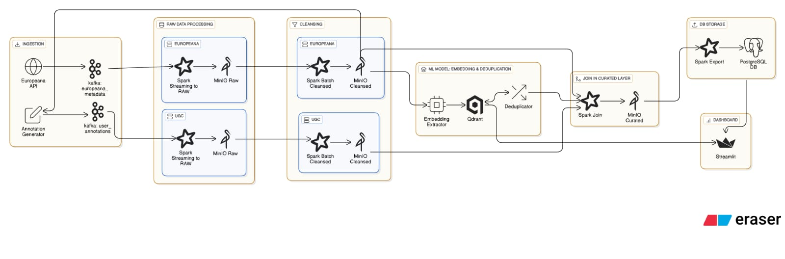
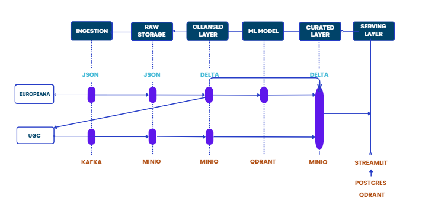

# Cultural Heritage Big Data Pipeline

## 1. Overview
> Breve introduzione al progetto: obiettivo, ambito applicativo, tecnologie principali.

This project aims to design and prototype a big data system that supports the digitization, analysis, and exploration of large-scale cultural heritage collections. These include artifacts, manuscripts, images, and user-contributed metadata from museums, libraries, and historical archives.

This project implements a full data pipeline for collecting, ingesting, processing, and serving cultural heritage data. It includes simulated user interactions and metadata ingestion into Kafka, followed by structured processing with Apache Spark and storage in MinIO using a Delta Lake architecture.
The pipeline supports semantic deduplication, metadata enrichment, and content-based recommendations. Deduplicated and enriched data is then exported from MinIO to PostgreSQL, which integrates with the serving layer to power structured queries and dashboard visualizations.

The Streamlit dashboard lets users explore cultural content through search, filtering, and similarity-based navigation.

---

## 2. System architecture

### 2.1 Architecture overview



### 2.2 Data flow diagram



### 2.3 File structure

---

## 3. Data Sources

### 3.1 Europeana Metadata

Europeana metadata is collected using the `europeana_ingest_batch.py` script, which performs provider-based, paginated API queries, filters for objects with images, ensures uniqueness using GUIDs, and streams the cleaned metadata into the `europeana_metadata` Kafka topic.

**How data is collected:**
- The script queries the Europeana REST API, scrolling results for each provider with parameters such as type (IMAGE), language (en), and cursor-based pagination.
- Only records with a valid image URL (`edmIsShownBy` or `isShownBy`) and a unique `guid` are ingested.
- The process avoids duplicates by keeping track of downloaded GUIDs in the file `downloaded_guids.txt`.
- The collected metadata is sent as JSON messages to Kafka for downstream processing.

**Key fields extracted for each object:**
- `guid`: Unique Europeana identifier (primary key for all downstream tables)
- `title`: Object title
- `image_url`: Direct URL to the object's image (`edmIsShownBy` or `isShownBy`)
- `timestamp_created`: Ingestion timestamp (UTC, ISO format)
- `provider`: Name of the Europeana data provider
- `description`: Description or abstract
- `creator`: Author or artist name
- `subject`: Main subject or tag
- `language`: Language code
- `type`: Type of object (e.g. IMAGE)
- `format`: Original format if available
- `rights`: Rights statement
- `dataProvider`: Source institution
- `isShownAt`: Link to the object page on the provider's website
- `edm_rights`: Rights in EDM schema

--- 

### 3.2 User Annotations (Synthetic)

Synthetic user annotations are generated automatically using the `annotation_producer.py` script. The purpose is to simulate user engagement such as tagging, commenting, and localization on cultural heritage objects.

**How annotations are generated:**
- The script loads the list of all available object GUIDs from the cleansed Europeana metadata on MinIO.
- At regular intervals, it generates random annotations linked to these GUIDs.
- Each annotation simulates a real user, randomly selecting user IDs, tags, comments, and locations from pre-defined pools.

**Message structure:**
Each user annotation is sent to the Kafka topic `user_annotations` as a JSON object with the following fields:
- `guid`: Europeana object identifier (used as foreign key)
- `user_id`: Synthetic username or ID
- `tags`: List of 2–4 descriptive tags
- `comment`: Simulated free-text comment in English 
- `timestamp`: Annotation creation time (UTC, ISO format)
- `location`: User’s city or region 

---

## 4. Technologies Used

| Technology      | Role                                                                                                                     | Justification                                                                              |
|-----------------|--------------------------------------------------------------------------------------------------------------------------|-------------------------------------------------------------------------------------------|
| **Kafka**           | Ingests Europeana metadata and user annotations; buffers, partitions, and distributes data streams to processing components. | Enables scalable and asynchronous ingestion of large volumes of data from heterogeneous sources. |
| **MinIO**           | Stores as a data lake Lake all ingested data (JSON, metadata, ugc) in a 3-layer Delta Lake Architecture (raw, cleansed, curated); provides S3 interface for Spark and other tools | Provides distributed storage and efficient access to data via S3-compatible APIs.          |
| **Spark**           | Cleanses, deduplicates, and transforms ingested data in both batch and streaming; maintains reliable ACID tables.         | Ensures parallel and reliable processing of large-scale data; unifies batch and streaming. |
| **CLIP (OpenAI)**   | Generates image embeddings (for deduplication and recommendations) and text embeddings (for recommendations).             | Provides semantic enrichment of objects and enables both deduplication and retrieval.      |
| **Qdrant**          | Indexes embeddings from CLIP; used for image deduplication and powering semantic search and recommendations.              | Enables fast vector search and similar object recommendations on the dashboard.            |
| **PostgreSQL**      | Hosts the final joined and deduplicated collection, supporting flexible queries and dashboard integration.                | Robust relational database for analytics and Streamlit integration.                        |
| **Streamlit**       | Provides an interactive web dashboard for searching, visualizing, and recommending deduplicated cultural heritage data.   | Enables exploration with data and recommendations.           |
| **Docker Compose**  | Orchestrates and isolates all services (Spark, MinIO, Qdrant, dashboard, etc.) for easy local or cloud deployment.        | Simplifies launching, managing, and reproducing the entire pipeline.                      |

---

## 5. Pipeline Stages
The pipeline is devided into specific layers: 

### 5.1 Ingestion Layer

In this layer, we ingest metadata from the [Europeana API](https://pro.europeana.eu/page/get-api), using a fixed list of cultural collections providers. Here, we simulate the scenario of a heritage site self-uploading its images and their metadata. In parallel, to simulate user interactions, we've built a producer of user-generated content that writes comments and tags on existing objects ingested from [Europeana](https://www.europeana.eu/it).

To do so, we have created two Kafka topics (`europeana_metadata` and `user_annotations`), where we publish our records, respectively ingested with a batch job from Europeana and produced every 0.5 seconds using a simulated event loop.

In the ingestion layer we don't write directly to MinIO, but we use Kafka to ensure decoupled, scalable ingestion and short-term fault-tolerant buffering before the data is processed and persisted to MinIO.

> It is really important to request your [API key](https://pro.europeana.eu/page/get-api), and create your `.env` file (ignored in the `.gitignore`) in the `europeana-ingestion/` folder to store your key as a variable.

### 5.2 Raw Storage Layer

In this layer, data is consumed from the Kafka topics and written to MinIO, which acts as our data lake. We adopt a **Delta Lake architecture**, organizing data into three layers: `raw/`, `cleansed/`, and `curated/`.

The raw layer stores append-only JSON records, preserving the original structure of the messages for traceability and reprocessing.

We chose Delta Lake on MinIO to ensure scalable, schema-aware storage with built-in versioning and ACID transactions. This architecture allows us to perform efficient batch and streaming transformations with Spark, while preserving data consistency, enabling schema enforcement, and supporting rollback via time travel. It also maintains a clear separation between raw input and processed outputs across the pipeline.

In this layer, data is consumed from Kafka and written to MinIO in append-only JSON format using Spark Structured Streaming. Europeana metadata is stored as one file per record, while user annotations are aggregated into a single file per batch and partitioned by date. 

### 5.3 Cleansing Layer

In this layer, raw data is validated, cleaned, and transformed into Delta Tables stored on MinIO. We use Spark in batch mode to process both Europeana metadata and user-generated content. 

For user annotations, the cleansing job reads JSON files from the raw layer, validates the structure, and chek if there are duplicates. Cleaned records are written using Delta Lake in `append` mode. This strategy reflects the nature of annotations as high-frequency, additive content. 

For Europeana metadata, the job reads the JSON files, filters out malformed or incomplete records (e.g., null `guid` or missing `image_url`), removes duplicates on `guid`, and then writes the cleaned results in Delta format.

For this job, we initially used an `overwrite` strategy to fully replace the cleansed Europeana table at each run. Since this approach is computationally expensive and not optimized for frequent batch updates, we switched to a Delta `MERGE` strategy that incrementally inserts only new records based on `guid`, to improve the overall performance (you can find both scripts in the `eu-to-cleansed/` folder, and you can decide the one to run in the file `scheduler.py` in the same folder). In the future, the use of Delta Lake's `OPTIMIZE` command could enhance storage efficiency and query performance by compacting small files.

### 5.4 Machine Learning Model
This layer is responsible for enriching cleaned cultural heritage metadata with semantic embeddings, enabling both deduplication and recommendation functionalities.

We use **CLIP ViT-B/32**, a multimodal model from Hugging Face, to extract:
- A 512-dimensional **image embedding**
- A 512-dimensional **text embedding** built from selected fields considered most informative

Embedding Usage:
- The image-only vector is then used to detect semantic duplicates, using a similarity threshold
- The image vector and text vector are concatenated into a **1024-dimensional combined vector**, used for recommendation purposes in the final dashboard, powering the "Find similar objects" feature.

Embeddings are stored in **Qdrant**, an open-source vector database designed for high-performance similarity search. We chose Qdrant because:
- It supports **cosine similarity**, which aligns with CLIP’s embedding geometry
- It offers **fast and scalable search**, including approximate or exact modes
- It includes built-in **evaluation tools** like `precision@k` to assess retrieval quality
- It supports custom payloads and semantic filtering (e.g., by `status`, `guid`, `canonical_id`)

#### Visualizing semantic similarity
To llustrate how Qdrant  organizes and retrieves embeddings, we recorded a short **screen recording** of the vector dashboard in action. The video shows:
- A **graph view** of the `heritage_embeddings` collection, where each **node** represents a vector and **edges** indicate semantic similarity score.
- **Interactive exploration**: clicking on a purple node shows its associated metadata (`guid`, `canonical_id`, `status`, etc. that can be seen on the right) in the payload panel. Green nodes represent similar items retrieved in real-time.
- **Similarity search expansion**: dragging the graph reveals clusters of related items, visualizing how Qdrant builds neighborhoods based on embedding distance.


### 5.5 Join to Curated Layer
- Join tra oggetti Europeana e annotazioni
- Uso di canonical_id
- Output finale (Delta + PostgreSQL)
- SILVIA FARE JOIN

### 5.6 Serving Layer

The final Spark job reads the joined Delta table from the curated layer, selects and maps the key fields (e.g., `guid`, `user_id`, `title`, etc.), and writes the results to a PostgreSQL table. This step prepares the data for downstream usage, including dashboard visualization and structured SQL querying.

PostgreSQL is not used as our storage layer (this role is done by MinIO), but it works as a relational interface that supports efficient access to curated metadata from the dashboard.

The interactive dashboard, built with Streamlit ([http://localhost:8501/](http://localhost:8501/)), allows users to:
- Explore a random selection of images from the ingested collections
- Apply filters to search metadata (e.g., by creator, data provider, or tags)
- View user annotations alongside cultural metadata

The recommendation system is implemented in Streamlit: when a user selects an image, the system sends a request to Qdrant, which retrieves the top 10 most similar images based on cosine similarity of the `combined` embedding vector. This embedding captures both visual and textual semantics of the object, enabling cross-modal recommendations that consider both content and context.

---

## 6. How to Run

**PREREQUISITES**
Before starting the project, ensure the following requirements are met:

- **Docker and Docker Compose installed** on your machine  
  - [Get Docker](https://docs.docker.com/get-docker/)  
  - [Get Docker Compose](https://docs.docker.com/compose/install/)
- **create a file `.env`** (already ignored in the `gitignore`). You need to place this file in the `kafka-producers/europeana-ingestion/` folder. 
  - This file should contain your Europeana API Key (that you need to request [here](https://pro.europeana.eu/page/get-api)), stored like this `API_KEY=your_key_here`.

**RECOMMENDED**
- **At least 12 GB RAM available**
- **At least 10 CPU Cores** 

### 6.1 Docker Compose Setup

    1. Clone the repo: git clone https://github.com/dieccoo/Cultural-heritage-bigdata-project

    2. Make sure you've created the `.env` file, storing your Europeana API key in the right directory (`kafka-producers/europeana-ingestion/`)

    3. Once inside the Cultural-heritage-bigdata-project directory run:   docker compose up --build –d  

### 6.1 Services, Volumes, and Network

- **Network**
  All containers are connected via a shared Docker network (**heritage-net**).  
  This network allows secure communication between services using service names.

- **Service dependencies**:  
  Several containers depend on others to start correctly (e.g., Kafka depends on Zookeeper, Spark jobs wait for MinIO and Kafka to be up, Streamlit waits for PostgreSQL and Qdrant). Docker Compose manages these dependencies to ensure correct startup order.

- **Volumes**:  
  Docker named volumes are used for data persistence. This means storage for MinIO, PostgreSQL, Qdrant, and shared intermediate data remains safe even if you restart or update containers. Without these volumes, your data would be lost at every restart.

- **Note on the dashboard**:  
  You can access the dashboard via [http://localhost:8501/](http://localhost:8501/). Be careful if you run all services simoultaneously, if you want to see the updated results on the dashboard you don't have to **refresh** the page, but you have to **restart** the `Streamlit` container with:
  ```sh
  docker compose restart streamlit
    ```
---

## 7. Example Usage

### 7.1 Dashboard Features
> Esplorazione, filtri, similar images, dettagli.

### 7.2 Query Examples
> Query su PostgreSQL (es. filtra per autore)  
> Query su Qdrant (es. simili per embedding)

---

## 10. Limitations & Future Work
> Cosa manca, cosa può essere migliorato, estensioni possibili.

---
## 11. References & Acknowledgments

- [PostgreSQL vs Redis](https://risingwave.com/blog/postgresql-vs-redis-performance-and-use-case-comparison/)

- [Spark vs Flink](https://www.datacamp.com/blog/flink-vs-spark)

- [Delta Lake documentation](https://delta.io/)

- [Delta Lake Architecture explenation](https://medium.com/codex/delta-lake-architecture-simplifying-data-engineering-analytics-needs-8d8be8459678)

- [Europeana API Key](https://pro.europeana.eu/page/get-api)


## 12. Authors & Contact
This project was developed by Group number 8 represented by:

1. Silvia Bortoluzzi - [@silviabortoluzzi](https://github.com/silviabortoluzzi)
2. Diego Conti - [@diecccoo](https://github.com/diecccoo)
3. Sara Lammouchi - [@saralammouchi](https://github.com/saralammouchi)

---
